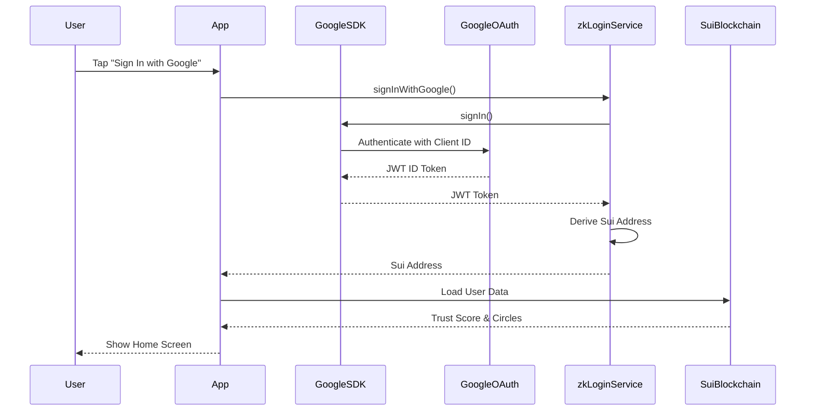

# Design Document: Google OAuth Configuration for zkLogin

## Overview

This design provides a comprehensive solution for configuring Google OAuth authentication in the VeryTontine Flutter app. The implementation will replace the placeholder client ID with real credentials, enabling zkLogin functionality for production use.

## Architecture

### High-Level Flow

```
User Taps "Sign In" 
  → zkLogin Service Initializes
  → Google Sign-In SDK Authenticates
  → JWT Token Retrieved
  → Sui Address Derived
  → User Authenticated
```

### Component Interaction



## Components and Interfaces

### 1. Google Cloud Console Configuration

**Purpose**: Set up OAuth 2.0 credentials for the application

**Configuration Steps**:

1. **Create/Select Project**
   - Navigate to [Google Cloud Console](https://console.cloud.google.com/)
   - Create new project or select existing: "VeryTontine"
   - Note the Project ID

2. **Configure OAuth Consent Screen**
   - Navigate to: APIs & Services → OAuth consent screen
   - User Type: External (for public app) or Internal (for organization)
   - App Information:
     - App name: "VeryTontine"
     - User support email: [developer email]
     - App logo: [optional]
   - Scopes: openid, email
   - Developer contact: [developer email]
   - Save and Continue

3. **Create OAuth 2.0 Credentials**
   
   **Android Client**:
   - Navigate to: APIs & Services → Credentials
   - Click: Create Credentials → OAuth client ID
   - Application type: Android
   - Name: "VeryTontine Android"
   - Package name: `com.verytontine.verytontine_flutter`
   - SHA-1 certificate fingerprint: [from debug/release keystore]
   - Create

   **Web Client** (for iOS/Web support):
   - Create Credentials → OAuth client ID
   - Application type: Web application
   - Name: "VeryTontine Web"
   - Authorized redirect URIs: `com.verytontine.app:/oauth2redirect`
   - Create

4. **Download Configuration**
   - Download `google-services.json` (Android)
   - Save Client IDs for code configuration

### 2. Certificate Fingerprint Generation

**Debug Keystore** (for development):

```bash
# Linux/Mac
keytool -list -v -keystore ~/.android/debug.keystore -alias androiddebugkey -storepass android -keypass android

# Windows
keytool -list -v -keystore "%USERPROFILE%\.android\debug.keystore" -alias androiddebugkey -storepass android -keypass android
```

**Release Keystore** (for production):

```bash
# Generate release keystore (if not exists)
keytool -genkey -v -keystore ~/verytontine-release-key.jks -keyalg RSA -keysize 2048 -validity 10000 -alias verytontine

# Get SHA-1 fingerprint
keytool -list -v -keystore ~/verytontine-release-key.jks -alias verytontine
```

**Extract SHA-1**: Look for "SHA1:" in the output and copy the fingerprint (format: `AA:BB:CC:...`)

### 3. Android Application Configuration

**File**: `verytontine_flutter/android/app/build.gradle.kts`

Current configuration is correct:
```kotlin
manifestPlaceholders["appAuthRedirectScheme"] = "com.verytontine.app"
```

**File**: `verytontine_flutter/android/app/src/main/AndroidManifest.xml`

Ensure package name matches:
```xml
<manifest xmlns:android="http://schemas.android.com/apk/res/android"
    package="com.verytontine.verytontine_flutter">
```

### 4. zkLogin Service Configuration

**File**: `verytontine_flutter/lib/services/zk_login_service.dart`

**Current (Broken)**:
```dart
static const String _googleClientId = 'YOUR_GOOGLE_CLIENT_ID.apps.googleusercontent.com';
```

**Updated (Working)**:
```dart
// Android OAuth Client ID from Google Cloud Console
static const String _googleClientId = 'YOUR_ACTUAL_CLIENT_ID.apps.googleusercontent.com';

// For iOS support, add:
static const String _googleClientIdIOS = 'YOUR_IOS_CLIENT_ID.apps.googleusercontent.com';
```

**Platform-Specific Configuration**:
```dart
import 'dart:io' show Platform;

String get _platformClientId {
  if (Platform.isAndroid) {
    return _googleClientId;
  } else if (Platform.isIOS) {
    return _googleClientIdIOS;
  }
  throw UnsupportedError('Platform not supported');
}

final GoogleSignIn _googleSignIn = GoogleSignIn(
  clientId: _platformClientId,
  scopes: ['openid', 'email'],
);
```

### 5. Environment Configuration

**Development vs Production**:

Create configuration file: `verytontine_flutter/lib/config/oauth_config.dart`

```dart
class OAuthConfig {
  static const bool isProduction = bool.fromEnvironment('PRODUCTION', defaultValue: false);
  
  // Debug credentials (for development)
  static const String debugAndroidClientId = 'DEBUG_CLIENT_ID.apps.googleusercontent.com';
  
  // Production credentials (for release)
  static const String prodAndroidClientId = 'PROD_CLIENT_ID.apps.googleusercontent.com';
  
  static String get androidClientId {
    return isProduction ? prodAndroidClientId : debugAndroidClientId;
  }
}
```

**Usage in zkLogin Service**:
```dart
import '../config/oauth_config.dart';

final GoogleSignIn _googleSignIn = GoogleSignIn(
  clientId: OAuthConfig.androidClientId,
  scopes: ['openid', 'email'],
);
```

## Data Models

### OAuth Configuration Model

```dart
class OAuthCredentials {
  final String clientId;
  final String clientSecret; // Optional, not needed for mobile
  final List<String> scopes;
  final String redirectUri;
  
  const OAuthCredentials({
    required this.clientId,
    this.clientSecret = '',
    required this.scopes,
    required this.redirectUri,
  });
}
```

### Authentication State Model

```dart
class AuthenticationResult {
  final bool success;
  final String? suiAddress;
  final String? idToken;
  final String? errorMessage;
  final AuthErrorType? errorType;
  
  const AuthenticationResult({
    required this.success,
    this.suiAddress,
    this.idToken,
    this.errorMessage,
    this.errorType,
  });
}

enum AuthErrorType {
  configurationError,    // Invalid client ID
  signatureMismatch,     // SHA-1 fingerprint mismatch
  networkError,          // Connection issues
  userCancelled,         // User cancelled sign-in
  tokenError,            // Failed to get JWT
  unknown,               // Other errors
}
```

## Correctness Properties

*A property is a characteristic or behavior that should hold true across all valid executions of a system—essentially, a formal statement about what the system should do. Properties serve as the bridge between human-readable specifications and machine-verifiable correctness guarantees.*

### Property 1: Valid Client ID Format
*For any* OAuth client ID configured in the system, it must match the format `[PROJECT_ID]-[RANDOM].apps.googleusercontent.com` and not contain the placeholder text "YOUR"

**Validates: Requirements 1.5, 3.1**

### Property 2: SHA-1 Fingerprint Consistency
*For any* build variant (debug or release), the SHA-1 fingerprint registered in Google Cloud Console must match the fingerprint of the keystore used to sign the APK

**Validates: Requirements 2.2, 4.3**

### Property 3: Package Name Consistency
*For any* OAuth configuration, the package name in Google Cloud Console must exactly match the applicationId in build.gradle.kts (`com.verytontine.verytontine_flutter`)

**Validates: Requirements 2.1, 1.4**

### Property 4: JWT Token Validation
*For any* successful Google Sign-In, the returned JWT token must contain valid `sub` (subject) and `aud` (audience) claims that can be decoded without errors

**Validates: Requirements 3.3, 3.4**

### Property 5: Sui Address Derivation
*For any* valid JWT token and salt value, the derived Sui address must be a valid 42-character hexadecimal string starting with "0x"

**Validates: Requirements 3.4**

### Property 6: Environment-Specific Credentials
*For any* build configuration (debug or release), the system must use the corresponding OAuth client ID without mixing development and production credentials

**Validates: Requirements 5.1, 5.2, 5.3**

### Property 7: Error Message Clarity
*For any* authentication failure, the error message displayed to the user must be one of the predefined user-friendly messages, not raw exception text

**Validates: Requirements 6.1, 6.2, 6.3, 6.4**

### Property 8: Secure Token Storage
*For any* OAuth token or sensitive credential, it must never be logged in plain text or stored in insecure locations (SharedPreferences without encryption)

**Validates: Requirements 7.1, 7.4**

## Error Handling

### Error Code Mapping

| Google Error Code | User-Friendly Message | Action |
|-------------------|----------------------|--------|
| 10 (Developer Error) | "App configuration error. Please contact support." | Check client ID and SHA-1 |
| 7 (Network Error) | "Network connection failed. Please check your internet." | Retry with exponential backoff |
| 12501 (User Cancelled) | Silent return to login | No error shown |
| 8 (Internal Error) | "Authentication service unavailable. Please try again." | Retry after delay |

### Implementation

```dart
AuthenticationResult _handleGoogleSignInError(dynamic error) {
  if (error is PlatformException) {
    switch (error.code) {
      case 'sign_in_failed':
        // Extract error code from message
        if (error.message?.contains('10:') ?? false) {
          return AuthenticationResult(
            success: false,
            errorMessage: 'App configuration error. Please contact support.',
            errorType: AuthErrorType.configurationError,
          );
        }
        break;
      case 'network_error':
        return AuthenticationResult(
          success: false,
          errorMessage: 'Network connection failed. Please check your internet.',
          errorType: AuthErrorType.networkError,
        );
      case 'sign_in_canceled':
        return AuthenticationResult(
          success: false,
          errorMessage: null, // Silent failure
          errorType: AuthErrorType.userCancelled,
        );
    }
  }
  
  return AuthenticationResult(
    success: false,
    errorMessage: 'Authentication failed. Please try again.',
    errorType: AuthErrorType.unknown,
  );
}
```

## Testing Strategy

### Unit Tests

1. **OAuth Configuration Validation**
   - Test client ID format validation
   - Test environment-specific credential loading
   - Test configuration error detection

2. **JWT Token Parsing**
   - Test valid JWT decoding
   - Test malformed JWT handling
   - Test missing claims detection

3. **Sui Address Derivation**
   - Test address format validation
   - Test deterministic address generation
   - Test salt randomness

### Integration Tests

1. **Google Sign-In Flow**
   - Test successful authentication with test account
   - Test user cancellation handling
   - Test network error scenarios

2. **zkLogin End-to-End**
   - Test complete flow from sign-in to Sui address
   - Test transaction signing with derived address
   - Test sign-out and cleanup

### Manual Testing Checklist

- [ ] Debug build authenticates successfully
- [ ] Release build authenticates successfully
- [ ] Error messages are user-friendly
- [ ] Sign-out clears all data
- [ ] App works offline after initial auth
- [ ] Multiple accounts can be switched

## Implementation Notes

### Quick Fix for Current Error

**Immediate Action** (to unblock development):

1. Get debug SHA-1 fingerprint:
   ```bash
   keytool -list -v -keystore ~/.android/debug.keystore -alias androiddebugkey -storepass android -keypass android | grep SHA1
   ```

2. Go to [Google Cloud Console](https://console.cloud.google.com/)
   - Create OAuth client ID (Android)
   - Package: `com.verytontine.verytontine_flutter`
   - SHA-1: [paste from step 1]

3. Copy the generated Client ID

4. Update `zk_login_service.dart`:
   ```dart
   static const String _googleClientId = '[YOUR_CLIENT_ID].apps.googleusercontent.com';
   ```

5. Rebuild and test:
   ```bash
   cd verytontine_flutter
   flutter clean
   flutter pub get
   flutter run
   ```

### Production Deployment

For production release:

1. Generate release keystore
2. Get release SHA-1 fingerprint
3. Create separate OAuth client for production
4. Use environment variables or build flavors
5. Test thoroughly before app store submission

## Security Considerations

1. **Never commit credentials to git**
   - Use environment variables
   - Add `oauth_config.dart` to `.gitignore`
   - Use CI/CD secrets for production

2. **Keystore security**
   - Store release keystore securely
   - Use strong passwords
   - Backup keystore safely

3. **Token management**
   - Use flutter_secure_storage for tokens
   - Implement token refresh logic
   - Clear tokens on sign-out

4. **API key restrictions**
   - Restrict OAuth client to specific package
   - Restrict to specific SHA-1 fingerprints
   - Monitor usage in Google Cloud Console
